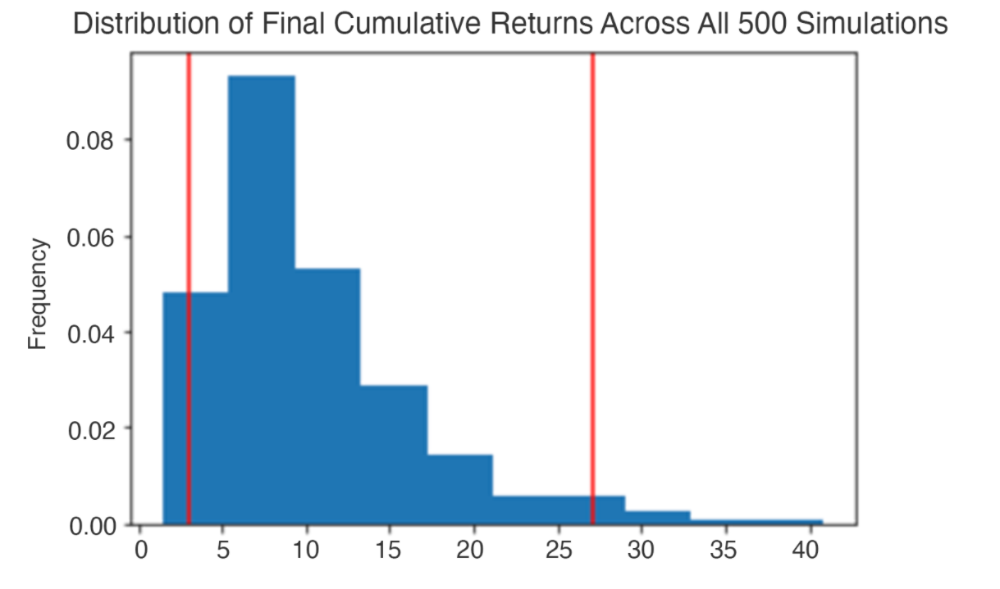

# Financial-Analysis-Tools
The project entails building a tool to help credit union members evaluate their financial health. Specifically, the credit union board wants the members to be able to do two things. First, they should be able to assess their monthly budgets. Second, they should be able to forecast a reasonably effective retirement plan based on their current holdings of cryptocurrencies, stocks, and bonds. 

This application will create two financial analysis tools by using a single Jupyter notebook:

A financial planner for emergencies. The members will be able to use this tool to visualize their current savings. The members can then determine if they have enough reserves for an emergency fund.

A financial planner for retirement. This tool will forecast the performance of their retirement portfolio in 30 years. To do this, the tool will make an Alpaca API call via the Alpaca SDK to get historical price data for use in Monte Carlo simulations.


---

## Technologies

This project leverages Anaconda and JupyterLab with Python 3.9:

* [Anaconda](https://www.anaconda.com/products/individual) 

Need to import the following libraries and dependencies:

```
import os
import requests
import json
import pandas as pd
from dotenv import load_dotenv
import alpaca_trade_api as tradeapi
from MCForecastTools import MCSimulation

%matplotlib inline
```

---

## Installation Guide

Before running the application first install the following dependencies.

### Part I--Install Anaconda
1. Install [Anaconda](https://www.anaconda.com/products/individual) from link 
2. Open up GitBash(Windows) or Terminal(Mac)
3. Type ```conda update conda``` to update Conda
4. Type ```conda update anaconda``` to update Anaconda
5. Type ```conda create -n dev python=3.9 anaconda```
6. Type ```conda activate dev``` to activate conda
7. Install a dev environment kernel by typing ```python -m ipykernel install --user --name dev```
8. Install a node environment by typing ```conda install -c conda-forge nodejs```
9. Launch JupyterLab by typing ```jupyter lab```

### Part II--Set Up the Python Modules and Libraries


OS: The OS module comes under Python's standard utility models and provides functions for interacting with the computer's operating system. The OS module does not require a separate download.

Requests: The Python Requests library helps you access data via APIs.

JSON: This library puts the response (that is, the data) from an API into a human-readable format.

The Requests and JSON libraries get installed with Anaconda. To confirm their installation, do the following:

In the terminal, activate the Conda development environment, and then run the following code:
```
conda list requests

conda list json
```
To install the Requests library, check that your development environment is active, and then run the following command:
```
conda install -c anaconda requests 
```

To install the JSON library, check that your development environment is active, and then run the following command:
```
conda install -c jmcmurray json 
```

### Part III--Set Up the Tools for Accessing APIs
An API is a set of functions that allows your computer to communicate with a company server to gather data. An SDK facilitates communication with a company API. Specifically, you’ll use the following APIs:

[Free Crypto API](https://alternative.me/crypto/api/) 

[Alpaca API](https://alpaca.markets/) 

To interact with these APIs, you need to set up and validate one library and one software development kit, or SDK. An SDK is software that facilitates communication with a specific API. The following subsections review the installation process for each. 

#### Install the python-dotenv Library

To install this library, run the following command in your terminal:

```
pip install python-dotenv  
```

#### Install the Alpaca SDK

To install this SDK, run the following command in your terminal:
```
pip install alpaca-trade-api
```

### Part IV--Supply Your Own Alpaca API Key and Alpaca Secret Key

In order to run this application, you will need to supply your own API keys in your ```.env``` file that looks like this:

ALPACA_API_KEY = “Your Alpaca API Key Here”

ALPACA_SECRET_KEY = “Your Alpaca Secret Key Here”

Save this file as ```.env```. 
Run ```financial_planning_tools.ipynb``` together with ```.env```

---

## Usage

You will need to clone the repo so that you can run the application:

```
 git clone https://github.com/locthai2002/Financial-Analysis-Tools.git
```

Here are some screenshots from running the application:

## Import the Libararies


## Create a Financial Planner for Emergencies


## Use Python requests library to get BTC price


## Evaluate the Stock and Bond Holdings


## Set Up Alpaca API and Secret Keys


## Evaluate the Emergency Fund


## Composition of Personal Savings


## Part 2: Create a Financial Planner for Retirement


## Get 3 years of historical closing prices for a traditional 60/40 portfolio split: 60% stocks (SPY) and 40% bonds (AGG)


## Distribution of Final Cumulative Returns 



## Forecast Cumulative Returns in 10 Years 


---

## Contributors

Loc Thai -- www.linkedin.com/in/loc-thai-69b8a2141
Phone: 415.400.9998

---

## License

MIT

